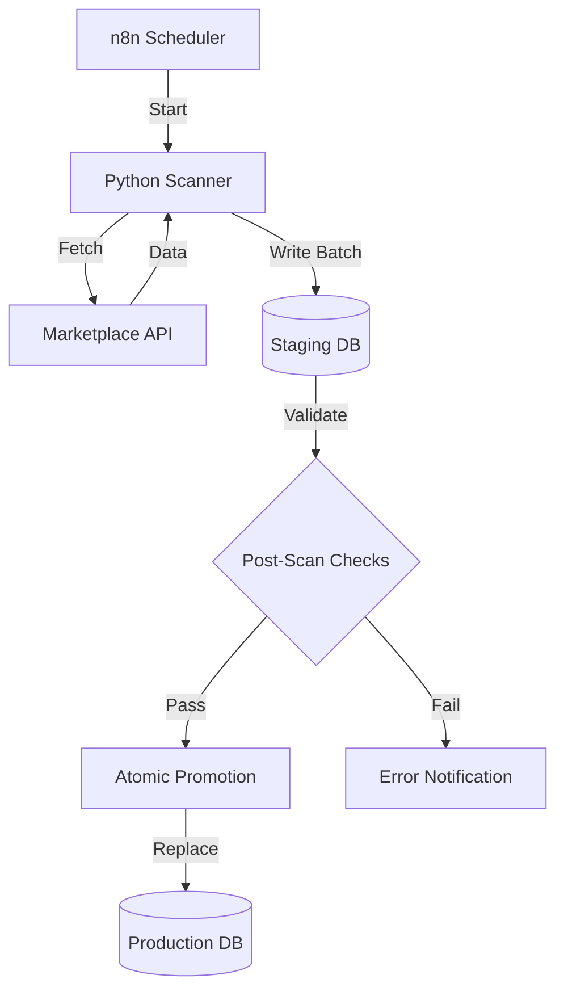
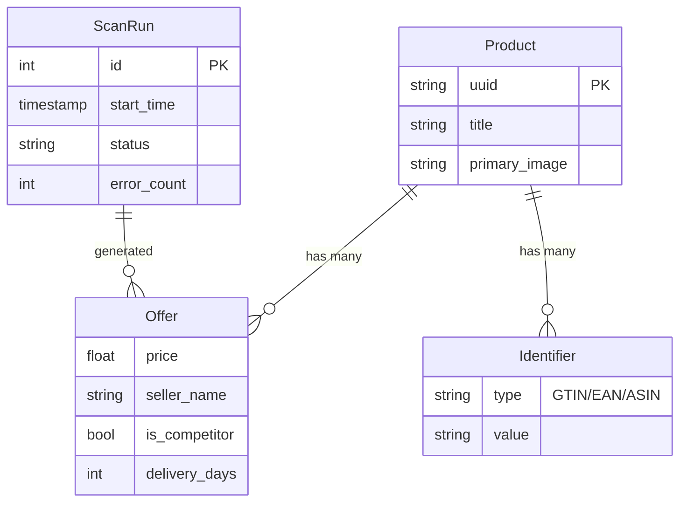

Market Monitor is a modular data pipeline that continuously collects product, offer, and pricing information across multiple marketplaces. It’s built for real-world constraints: large catalogs (170k+ products per marketplace), strict API rate limits, long-running jobs, and the need to keep dashboards usable while fresh data is still being ingested.

The key idea is **atomic staging**: each scan writes into staging tables first, then promotes the completed result into production in one step. That way, reporting and downstream processes always see a consistent dataset—either the previous scan or the new one—never a partially-updated mix.

## TL;DR
- Built a multi-marketplace ingestion pipeline that stays consistent during hours-long scans
- Uses staging tables + atomic promotion so production data is never partially updated
- Includes scan tracking, progress monitoring, rate limiting, and post-scan validation

## What it does
- Scans marketplaces via official APIs (and targeted scraping where needed)
- Normalizes data into a single PostgreSQL schema
- Tracks scan runs (start/end/fail), error counts, and quality metrics
- Uses concurrency + rate limiting to scale without getting blocked
- Promotes staging → production atomically per marketplace

## Why it’s interesting
Most “API integration” projects work fine at small scale. This one is designed for scale and reliability:
- Long-running scans with resumable, observable progress
- Process locking to prevent overlapping runs
- Validation and post-scan analysis to catch data regressions

## Problem & constraints
The system needed to answer a simple business question (“what’s happening to our prices and offers across marketplaces?”) under hard engineering constraints:
- **Huge catalog sizes** (170k+ products per marketplace)
- **Rate limits** and intermittent API/network failures
- **Long-running jobs** (minutes to hours) that must not break reporting
- **Different data shapes** per marketplace (identifiers, offer models, inventory, shipping)

## Key design decisions
- **Atomic staging per marketplace**: writes go to staging tables; promotion swaps in a complete snapshot.
- **Marketplace isolation**: each marketplace has its own client + processor, but shares the same pipeline contract.
- **Scan tracking**: every run records start/end/fail + outcome metrics so you can trend reliability over time.
- **Progress + observability**: periodic progress reporting for long scans (useful when running via automation).
- **Safety controls**: process locking prevents overlapping scans for the same job.

## Tech Stack

| Domain | Tools & Libraries |
|--------|-------------------|
| **Core Logic** | Python 3.11+, Pandas (Dataframes), Threading (Concurrency) |
| **Data Persistence** | PostgreSQL, SQLAlchemy (ORM), Alembic |
| **Integration** | `python-sp-api` (Amazon), Custom REST Clients (Kaufland/Galaxus) |
| **Scraping** | SeleniumBase (Headless Browser), BeautifulSoup4 (HTML Parsing) |
| **Infrastructure** | n8n (Workflow Orchestration), Linux (Ubuntu), Redis (Locking) |

## Production setup
This isn’t a demo project — it’s running in production for a client.
- Deployed on a self-hosted **n8n** instance on a Linux server
- I maintain the server environment (updates, Python installation, dependencies)
- Scans run on schedules and can be monitored via run logs + scan tracking records

## Automation & AI enrichment
In addition to raw monitoring, some feeds are enriched through AI workflows in n8n:
- **Amazon bestsellers / newcomers** and **Schutzfolie24 newcomers** are ingested as “trend signals”
- An AI step extracts structured attributes from noisy product metadata (e.g., model name, model numbers, device type)
- The workflows are designed to return strict JSON so downstream steps stay deterministic

## Architecture overview
The pipeline is designed for fault tolerance. If a scan fails 90% of the way through, the bad data is discarded and production remains untouched (Atomic Staging).



### Scan Process Sequence
The entire process simulates a transactional update on a massive scale.

```mermaid
sequenceDiagram
    participant S as n8n Scheduler
    participant P as Python Scanner
    participant M as Marketplace API
    participant DB as Postgres DB (Staging)
    participant PROD as Postgres DB (Prod)

    S->>P: Trigger Scan (Cron)
    activate P
    P->>P: Acquire Process Lock (Redis/File)
    
    loop Concurrent Batch Processing
        P->>M: Fetch Inventory/Offers (w/ Rate Limit)
        M-->>P: Raw Data
        P->>P: Normalize & Enrich
        P->>DB: Bulk Insert (Staging)
    end
    
    P->>DB: Run Integrity Checks (Counts, Missing Items)
    
    alt Integrity Pass
        rect rgb(23, 42, 23)
            note over P, PROD: Atomic Promotion Phase
            P->>PROD: Begin Transaction
            P->>PROD: Swap Staging -> Active Schema
            P->>PROD: Commit
        end
        P-->>S: Report Success (Metrics)
    else Integrity Fail
        P->>DB: Rollback / Discard Staging
        P-->>S: Alert Failure
    end
    
    deactivate P
```



## Data model (conceptual)
Normalization is critical here. While Amazon gives us ASINs and Kaufland gives us EANs, the database maps everything to a unified product entity to allow cross-marketplace price comparison.



## Marketplaces (modules)
I present this as one project with multiple modules to highlight different engineering challenges: **Scale** (Monitoring) and **Intelligence** (Trend Detection).

### 1. Core Price Monitoring (Amazon, Kaufland, Galaxus)
*Focus: High throughput, reliability, and data consistency.*

These modules monitor the client’s massive catalog (170k+ items) to track price changes and competitor offers.
- **Amazon Monitor:** Uses the official SP-API to scan own and competitor listings. Matches products via GTIN/EAN to ensure catalog consistency.
- **Kaufland Monitor:** Handles multi-account management (ZenGlass, Dipos) within a single scan cycle. Uses aggressive threading (60+ workers) to handle the volume within acceptable windows.
- **Galaxus Monitor:** Marketplace-aware scanning (DE/CH) with strict process locking to prevent overlapping jobs.

**Key constraint handled:** Atomic staging ensures that even if a scan takes 2 hours, the pricing dashboard never shows a mix of "old" and "new" data.

### 2. AI-Powered Trend Detection (Schutzfolie24, Amazon Newcomers)
*Focus: Unstructured data extraction and automation.*

The client uses these modules to spot new devices (e.g., a new "iPhone 17") immediately after they appear on competitor sites or bestseller lists.

- **The Flow:**
  1. **Scraper (Python):** Collects raw "New Arrivals" or "Bestsellers" data (titles, images, unstructured text).
  2. **n8n Workflow:** Passes raw data to an AI agent with a strict system prompt.
  3. **AI Extraction:** Extracts structured JSON fields (`model`, `model_numbers`, `device_type`) from messy inputs like *"Samsung Galaxy S25 Ultra 5G..."*.
  4. **Action:** Auto-tags products in the database.

> *Example AI Prompt Strategy:*
> The AI is instructed to return **strict JSON only**, filtering complex titles into standardized types (e.g., "Smartphone", "Tablet") and normalizing model names.
>
> ```json
> // The AI enforces this structure for every product detected
> {
>   "model": "iPhone 17 Pro",
>   "model_numbers": "MG8J4ZD/A, B0FQG15YVP",
>   "device_type": "Smartphone" // Enum: [Smartphone, Tablet, Smartwatch...]
> }
> ```
> This allows the client to auto-filter "new smartphones" without manual data entry.

### 3. Inventory Tooling (eBay)
- **eBay Inventory:** Handles bulk export and parsing of large XML seller lists (260k+ items) to audit listing status and shipping costs across international sites.

## Engineering Highlights
One thing I learned is that "scripts" aren't enough—you need **systems**.

### 1. Self-Healing Process Locks
To prevent a cron job from piling up 100 scanner instances if one hangs, I implemented a file-based lock that checks for **stale PIDs**.
- **The problem:** If a script crashes hard, the `lock.release()` in `finally:` might not run, leaving a "zombie" lock file that blocks all future runs.
- **The fix:** The lock checker reads the PID from the file and queries the OS (via `os.kill` on Linux or `ctypes` on Windows) to see if that process *actually* exists. If not, it self-heals by overriding the stale lock.

### 2. "Good Citizen" CLI Design for n8n
Since this runs in a workflow engine (n8n), the CLI behavior had to be strictly managed:
- **Exit Codes:** Uses semantic exit codes (0=Success, 1=Error, 2=Locked/Skipped) so the workflow can branch logic correctly.
- **Stream Redirection:** Python loggers often hijack `stderr`. I explicitly preserve the original `stderr` file descriptor to ensure critical infrastructure errors (like lock failures) bubble up to the n8n dashboard immediately, bypassing the internal application log.

### 3. Debugging the "Unscrapable"
For the scraping modules (Schutzfolie24), transient failures are common.
- I implemented a `save_debug_html` trigger: if a text parser fails or a CSRF token is missing, the script dumps the *exact* HTML payload it received to a timestamped file.
- This allowed me to debug obscure issues (like anti-bot challenges or layout A/B tests) that you can never reproduce locally.

### 4. Smart Caching & Thread-Safe Round Robin
To minimize API costs and latency, I built a multi-layered lookup strategy for Amazon catalog data:
- **Optimization:** Before hitting the API, it checks a local Postgres cache (valid for 30 days) for GTIN-to-ASIN mappings.
- **Round-Robin API Clients:** The scanner rotates through multiple API clients (ZenGlass, Dipos) using thread-safe locks (`threading.Lock`) to distribute load and avoid hitting per-account rate limits.
- **Batching & Retry Logic:** The `GTINProcessor` automatically batches lookups (20 items/chunk) and implements a smart "second pass" retry for any batches that fail due to transient network issues.

## Performance
- Concurrency is used where safe (thread pools for IO-bound fetches)
- The DB write path is optimized around staging to reduce lock contention
- Long scans remain observable with periodic progress logs

## Results (Production Metrics)
- **Catalog Scale:** Handled **~170k+ products** per marketplace (Kaufland DE) and ~260k+ inventory items (eBay).
- **Scan Durations:**
  - **Kaufland:** **~25 minutes** for 170k items (Active Concurrency: 60 threads).
  - **Galaxus:** **~5.7 hours** (DE) to **~13 hours** (CH) (throttled to respect strict anti-bot rate limits).
  - **Trend Scrapers:** **~12 minutes** end-to-end for daily newcomer detection.
- **Throughput:** Peaking at **~6,800 items/min** on high-concurrency modules (Kaufland).
- **Reliability:** **Zero system failures** in the last 30 days (100% success rate for scheduled runs), utilizing self-healing locks and automatic retries.

## What I’d improve next
- Add a small web UI for scan history + anomaly charts
- Add idempotent “resume from last successful page” for specific marketplaces
- Centralize a shared validation suite across all marketplace modules