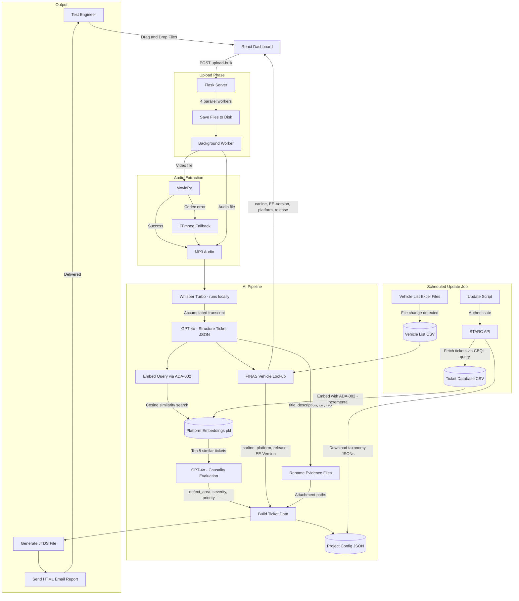

**AI Ticketing Assistant** is a specialized desktop application developed to streamline the defect reporting process for automotive validation teams. It automates the tedious task of manually filling out ticket fields by "listening" to voice notes from test drivers and engineers.

## Problem
Test engineers often record voice notes or take videos while driving or testing infotainment systems. Converting these unstructured observations into formal defect tickets requires:
1.  Manually transcribing the issue.
2.  Looking up vehicle metadata (Vehicle data, software version, hardware variant).
3.  Categorizing the defect (System, Function, Frequency).
4.  Attaching the correct evidence files.

This manual process is slow and prone to data entry errors.

## Solution
The AI Ticketing Assistant allows engineers to simply **drag and drop** their video or audio evidence into a dashboard. The system automatically:
-   **Transcribes** the voice commentary using a local Whisper model.
-   **Extracts** structured data (Defect Description, Reproduction Steps, System Domain) using GPT-4o.
-   **Matches** the test vehicle with internal fleet databases to auto-fill Vehicle and Software Configurations.
-   **Generates** ready-to-import ticket files (`.jtds`, `.json`) and formatted email reports.

## Tech Stack

| Domain | Technologies |
|---|---|
| **Frontend** | React, Vite, Material UI, React Window (Virtualization) |
| **Backend** | Python, Flask, Waitress (Production WSGI) |
| **AI (Speech)** | OpenAI Whisper (Local "Turbo" model) |
| **AI (Logic)** | Azure OpenAI (GPT-4o) |
| **Media** | FFmpeg, MoviePy (Audio extraction) |
| **Packaging** | PyInstaller (Single-file exe distribution) |

## Key Features

### 1. Hybrid AI Architecture & RAG
To balance privacy, cost, and speed, the application uses a hybrid approach:
-   **Local Processing:** High-bandwidth audio transcription happens *on-device* using a quantized **Whisper Turbo** model. This avoids uploading large video files to the cloud.
-   **Cloud Intelligence:** The text transcript is sent to **Azure OpenAI (GPT-4o)** for structuring.
-   **Duplicate Detection (RAG):** The system implements **Retrieval-Augmented Generation** to prevent duplicate tickets. It vectorizes thousands of existing defects (fetched from the internal STARC system API) using `text-embedding-ada-002` and checks for semantic similarities before a new ticket is created.

### 2. Advanced Prompt Engineering
The system relies on sophisticated system prompts (stored as text assets) to guide the AI's reasoning:
-   **Language Standardization:** The application enforces a strict "English Only" rule. If a test driver records a voice note in German or Mandarin, the AI automatically translates and standardizes the technical terminology into English for the official ticket.
-   **Causality Analysis:** The AI is explicitly prompted to distinguish between *symptoms* and *root causes*. For example, if "Navigation freezes when Bluetooth connects," the system is instructed to assign the defect to the *Bluetooth* team (the trigger), not the *Navigation* team (the victim), reducing ticket bouncing between departments.

### 3. Deep Knowledge Integration
The system is built to strictly adhere to corporate taxonomy.
-   **Auto-Updates:** It ingests massive configuration files (e.g., an 800,000+ line `DefectArea.json`) and parses internal "Vehicle List" Excel sheets to map a unified "Test-Environment" Car identifier (e.g., "174-1234") to specific technical details like Carline, Headunit Device, Hardware Version
-   **Self-Maintenance:** Background workers automatically detect changes in Excel vehicle lists and regenerate the internal CSV databases, ensuring the tool is always in sync with the latest test fleet.

### 4. Robust Media Handling
Handling video from various test devices (GoPro, iPhone, Dashcam) is notoriously difficult due to codec variations.
-   **Primary:** Uses `MoviePy` for standard containers.
-   **Fallback:** Implements a direct `FFmpeg` subprocess fallback to handle complex streams (like Apple's ProRes or multi-track audio) that often break Python wrappers.

### 5. Enterprise-Ready Dashboard
The React frontend is built for power users:
-   **Drag-and-Drop Grouping:** Users can drop 10 files and group them into distinct tickets visually.
-   **Virtualization:** Uses `react-window` to handle bulk uploads of hundreds of files without lagging the UI.
-   **Rich Reporting:** Generates HTML email reports using Jinja2 templates, embedding "Similarity Scores" directly in the notification so engineers can catch duplicates before even logging into the ticketing system.
-   **Local Persistence:** Remembers user preferences (Dark Mode, previously added car data) via local storage.

### 6. Self-Healing & Maintenance
One of the biggest risks for internal tools is "bit rot" when APIs change or reference data becomes stale.
-   **Automated Data Pipeline:** A scheduled background update job connects to the corporate STARC API to fetch the latest schemas, User IDs, and Platform definitions (e.g., `NTG7` vs `C174`).
-   **Vector Database Refresh:** As new bugs are reported by other teams, the application automatically indexes their embeddings overnight. This means "Duplicate Detection" and Defect Area retrieval gets smarter every day without code changes.

### 7. Operational Reliability & Privacy
-   **Reliable Processing Path:** The backend protects Whisper inference with thread locking and uses a resilient media pipeline (`MoviePy` first, `FFmpeg` fallback) to reduce failures in real-world uploads.
-   **Controlled API Usage:** Embedding updates use rate-limited parallel workers with checkpoint saves to keep long-running sync jobs stable.
-   **Privacy-Aware Design:** Audio/video stays local for preprocessing and transcription; only the transcription text is sent to cloud LLM services.

### 8. Adoption & Enablement
-   **Team Onboarding:** I created an internal walkthrough presentation and tutorial material so coworkers can adopt the tool quickly and use it consistently.

## Architecture

The application runs as a self-contained local server. When the user launches the `.exe`, it spins up a headless Flask/Waitress server and serves the React frontend (bundled as static assets) to the local browser.



## Key Code Snippet: Optimized File Uploads & FFmpeg Fallback

Handling large video uploads (4K test footage) requires careful stream management to prevent memory overflows, and robust fallbacks for media processing.

```python
def save_file_optimized(file_storage, save_path):
    """Save uploaded file with optimized buffering for faster I/O avoids MemoryErrors."""
    buffer_size = 16 * 1024 * 1024  # 16MB buffer
    with open(save_path, 'wb') as f:
        while True:
            chunk = file_storage.stream.read(buffer_size)
            if not chunk: break
            f.write(chunk)

def extract_audio(video_path, filename_base):
    """Robust audio extraction with fallback for complex codecs (e.g. iPhone HEVC)"""
    audio_path = os.path.join(app.config['AUDIO_FOLDER'], f"{filename_base}.mp3")
    
    try:
        # Fast path: Native Python wrapper
        video_clip = VideoFileClip(video_path)
        video_clip.audio.write_audiofile(audio_path, logger=None)
    except Exception as e:
        logger.warning(f"MoviePy failed for {filename_base}, engaging FFmpeg fallback...")
        
        # Robust path: Direct FFmpeg subprocess
        # -map 0:a:0 selects specifically the first audio track
        subprocess.run([
            'ffmpeg', '-i', video_path, '-vn', 
            '-map', '0:a:0', '-acodec', 'libmp3lame', 
            '-q:a', '2', '-y', audio_path
        ], check=True, timeout=300)
    
    return audio_path
```

## Impact & Results

While internal metrics are confidential, the tool solved critical workflow bottlenecks:
-   **Eliminated Data Entry:** Significantly reduced ticket creation time by automating transcription, structuring, evidence upload and metadata mapping.
-   **Standardized Quality:** Enforced English-only, structured descriptions across global teams, removing language barriers.
-   **Reduced Noise:** Proactively caught duplicate tickets via semantic search before they entered the triage queue.

## Challenges & Learnings
-   **PyInstaller & Whisper:** Bundling the large Whisper model weights inside a single-ofile executable was challenging. I solved this by managing resource paths dynamically to permit the app to find weights whether running as a script or a frozen `.exe`.
-   **Thread Safety:** The Whisper model is not inherently thread-safe. I implemented `threading.Lock()` around the transcription inference to allow the Flask server to handle concurrent types of requests (uploads, status checks) without crashing the AI engine.

