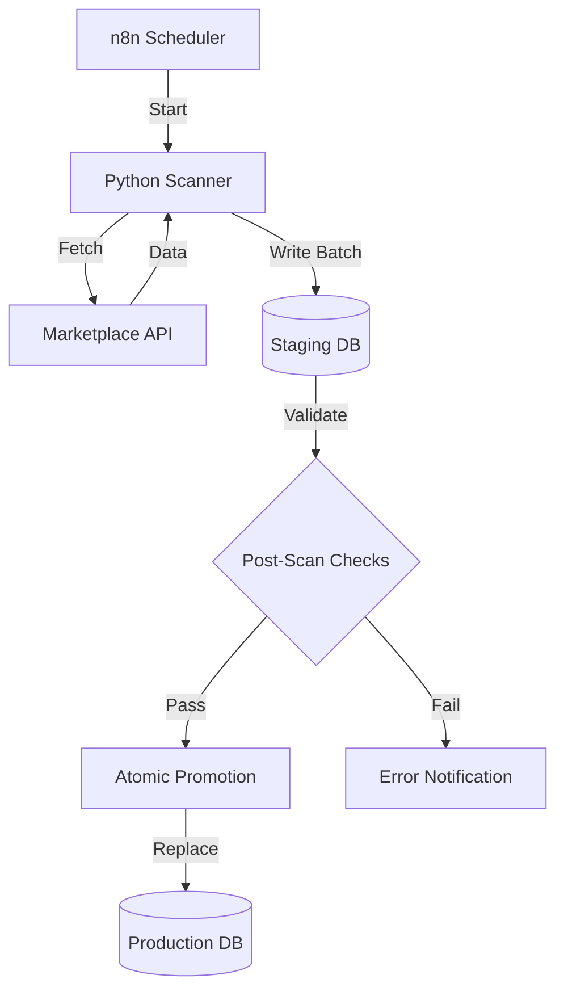
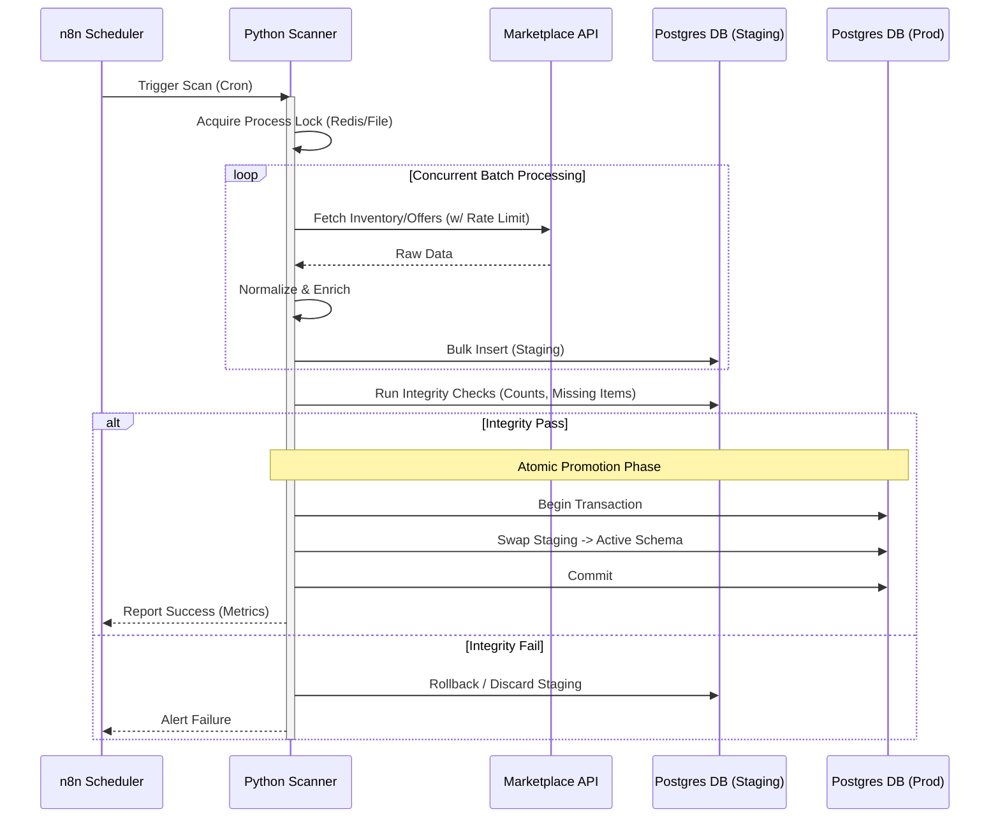

Market Monitor is a modular data pipeline that collects product, offer, and pricing data across multiple marketplaces under real constraints: large catalogs (170k+ items), strict rate limits, and long-running scans.

The core design is **atomic staging**: each scan writes to staging tables and promotes only after validation. Dashboards always see a consistent dataset—either the previous snapshot or the new one, never a partial mix.

## What it does
- Scans marketplaces via official APIs (and targeted scraping where needed)
- Normalizes data into a single PostgreSQL schema
- Tracks scan runs (start/end/fail), error counts, and quality metrics
- Uses concurrency + rate limiting to scale without getting blocked
- Promotes staging → production atomically per marketplace

## Problem & constraints
The system needed to answer a simple business question (“what’s happening to our prices and offers across marketplaces?”) under hard engineering constraints:
- **Huge catalog sizes** (170k+ products per marketplace)
- **Rate limits** and intermittent API/network failures
- **Long-running jobs** (minutes to hours) that must not break reporting
- **Different data shapes** per marketplace (identifiers, offer models, inventory, shipping)

## Key design decisions
- **Atomic staging per marketplace**: writes go to staging tables; promotion swaps in a complete snapshot.
- **Marketplace isolation**: each marketplace has its own client + processor, but shares the same pipeline contract.
- **Scan tracking**: every run records start/end/fail + outcome metrics so you can trend reliability over time.
- **Progress + observability**: periodic progress reporting for long scans (useful when running via automation).
- **Safety controls**: process locking prevents overlapping scans for the same job.

## Tech Stack

| Domain | Tools & Libraries |
|--------|-------------------|
| **Core Logic** | Python 3.11+, Pandas (Dataframes), Threading (Concurrency) |
| **Data Persistence** | PostgreSQL, SQLAlchemy (ORM), Alembic |
| **Integration** | `python-sp-api` (Amazon), Custom REST Clients (Kaufland/Galaxus) |
| **Scraping** | SeleniumBase (Headless Browser), BeautifulSoup4 (HTML Parsing) |
| **Infrastructure** | n8n (Workflow Orchestration), Linux (Ubuntu), Redis (Locking) |

## Production setup
This project runs in production for a client:
- Deployed on a self-hosted **n8n** instance on Linux
- Environment maintained by me (updates, Python runtime, dependencies)
- Scheduled scans monitored through workflow logs and scan tracking records

## Automation & AI enrichment
Some feeds are enriched through AI workflows in n8n:
- Ingests **Amazon bestsellers/newcomers** and **Schutzfolie24 newcomers** as trend signals
- Extracts structured attributes from noisy metadata (model, model numbers, device type)
- Enforces strict JSON outputs so downstream steps remain deterministic

## Architecture overview
The pipeline is designed for fault tolerance. If a scan fails 90% of the way through, the bad data is discarded and production remains untouched (Atomic Staging).

### Scan Process Sequence
The entire process simulates a transactional update on a massive scale.

## Marketplaces (modules)
I present this as one project with multiple modules to highlight different engineering challenges: **Scale** (Monitoring) and **Intelligence** (Trend Detection).

### 1. Core Price Monitoring (Amazon, Kaufland, Galaxus)
*Focus: High throughput, reliability, and data consistency.*

These modules monitor the client’s massive catalog (170k+ items) to track price changes and competitor offers.
- **Amazon Monitor:** Uses the official SP-API to scan own and competitor listings. Matches products via GTIN/EAN to ensure catalog consistency.
- **Kaufland Monitor:** Handles multi-account management (ZenGlass, Dipos) within a single scan cycle. Uses aggressive threading (60+ workers) to handle the volume within acceptable windows.
- **Galaxus Monitor:** Marketplace-aware scanning (DE/CH) with strict process locking to prevent overlapping jobs.

**Key constraint handled:** Atomic staging ensures that even if a scan takes 2 hours, the pricing dashboard never shows a mix of "old" and "new" data.

### 2. AI-Powered Trend Detection (Schutzfolie24, Amazon Newcomers)
*Focus: Unstructured data extraction and automation.*

These modules detect new devices as soon as they appear in competitor feeds or bestseller lists.

- **Flow:**
    1. Python scraper collects raw newcomer/bestseller data.
    2. n8n sends records to an AI extraction step.
    3. AI returns strict JSON (`model`, `model_numbers`, `device_type`).
    4. Products are auto-tagged for faster filtering and prioritization.

### 3. Inventory Tooling (eBay)
- **eBay Inventory:** Handles bulk export and parsing of large XML seller lists (260k+ items) to audit listing status and shipping costs across international sites.

## Engineering Highlights
- **Self-healing process locks:** Stale PID detection prevents blocked cron schedules after hard crashes.
- **Workflow-friendly CLI behavior:** Semantic exit codes (`0/1/2`) and explicit `stderr` handling improve n8n observability.
- **Scraper debugging hooks:** Timestamped HTML dumps speed up diagnosis of anti-bot and layout-change failures.
- **Smart caching + round-robin clients:** Reduced API pressure with cached GTIN→ASIN lookups and thread-safe client rotation.

## Performance
- Concurrency is used where safe (thread pools for IO-bound fetches)
- The DB write path is optimized around staging to reduce lock contention
- Long scans remain observable with periodic progress logs

## Results (Production Metrics)
- **Catalog Scale:** Handled **~170k+ products** per marketplace (Kaufland DE) and ~260k+ inventory items (eBay).
- **Scan Durations:**
  - **Kaufland:** **~25 minutes** for 170k items (Active Concurrency: 60 threads).
  - **Galaxus:** **~5.7 hours** (DE) to **~13 hours** (CH) (throttled to respect strict anti-bot rate limits).
  - **Trend Scrapers:** **~12 minutes** end-to-end for daily newcomer detection.
- **Throughput:** Peaking at **~6,800 items/min** on high-concurrency modules (Kaufland).
- **Reliability:** No failed scheduled runs observed in the last 30 days, supported by self-healing locks and automatic retries.

## What I’d improve next
- Add a small web UI for scan history + anomaly charts
- Add idempotent “resume from last successful page” for specific marketplaces
- Centralize a shared validation suite across all marketplace modules